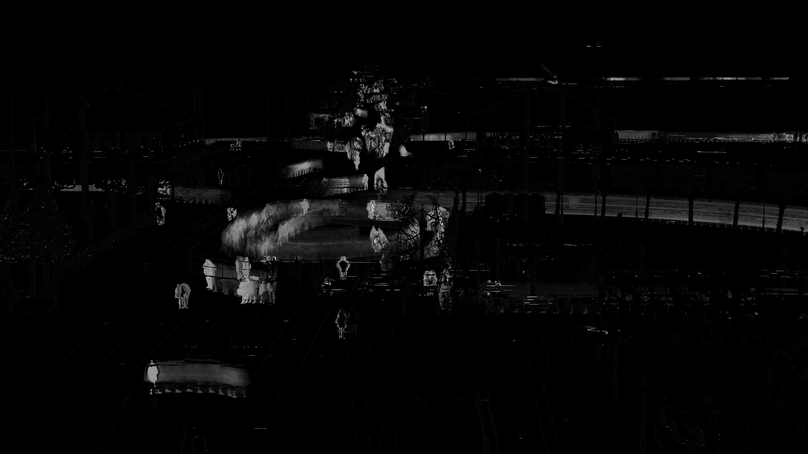

# motion-heatmap-opencv

This is a simple script that harnesses the power of OpenCV to generate a heatmap reflecting motion within a video. By employing the MOG background subtractor, motion is detected and subsequently illustrated in a visually appealing heatmap.

_Sample mask output_

## Prerequisites

Ensure that you have Python 3.6+ installed on your machine. Additionally, this script relies on OpenCV version 3.3.0 or higher, and numpy.

## Installation

Install the required packages by running:

`pip install opencv-python numpy`

For the MOG background subtractor and a progress animation, execute:

`pip install opencv-contrib-python progress`

## Usage

Using the command line, navigate to the directory in which you wish to store the script and run:

`git clone https://github.com/charlieforward9/motion-heatmap-opencv.git`

Navigate to the directory:

`cd motion-heatmap-opencv`

Copy the video file (.MP4 or .MOV) you wish to process into the directory, then run the script:

`python motion_heatmap.py <filename>`

## Output

**frames/**: The frames extracted from the video.

**mask.jpg**: The mask generated by the MOG background subtractor.

**diff-overlay.jpg**: The difference between the mask and the frames.
